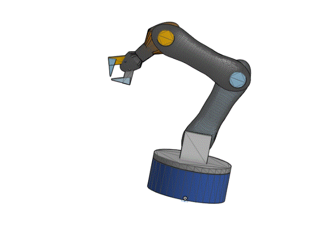

# -.

## 🤖 5 DOF Robotic Arm – ذراع روبوتية بخمس درجات حرية

### 📌 فكرة المشروع  
تصميم ذراع روبوتية ثلاثية الأبعاد تحتوي على **5 درجات حرية** (5 Degrees of Freedom)، تحاكي حركة الذراع البشري، وتشمل القاعدة، الكتف، الكوع، الرسغ، والقبضة.

---

### 🧱 مكونات الذراع
- **Base** – دوران أفقي
- **Shoulder** – رفع وخفض الذراع
- **Elbow** – ثني الذراع
- **Wrist Pitch** – حركة الرسغ للأمام والخلف
- **Wrist Roll / Gripper** – دوران أو إمساك الأجسام

---

### 🛠️ الأدوات المستخدمة
- 🎨 **Onshape** لتصميم المجسم ثلاثي الأبعاد
- 🧠 نموذج مقسم إلى عدة أجزاء ليسهل التعديل والمحاكاة
- 🔧 كل جزء ملوّن لتمثيل المفاصل المختلفة بوضوح

---

### 🎯 الهدف من المشروع
- التعرف على مفهوم **Degrees of Freedom في الروبوتات**
- بناء نموذج قابل للتطوير والتركيب
- دعم مشاريع التعليم والهندسة الميكانيكية

---

### 📦 المحتوى المرفق
- ملفات `.STL` لجميع الأجزاء
- صور للنموذج النهائي بعد التلوين
- ملف `.onshape link` (رابط التصميم على Onshape)

---

### 🎞️ عرض متحرك للذراع الروبوتية

تم تصميم هذه الذراع باستخدام Onshape، وتحاكي حركة الذراع البشري بـ **5 درجات حرية**.
